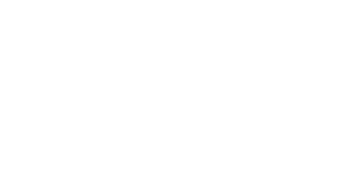
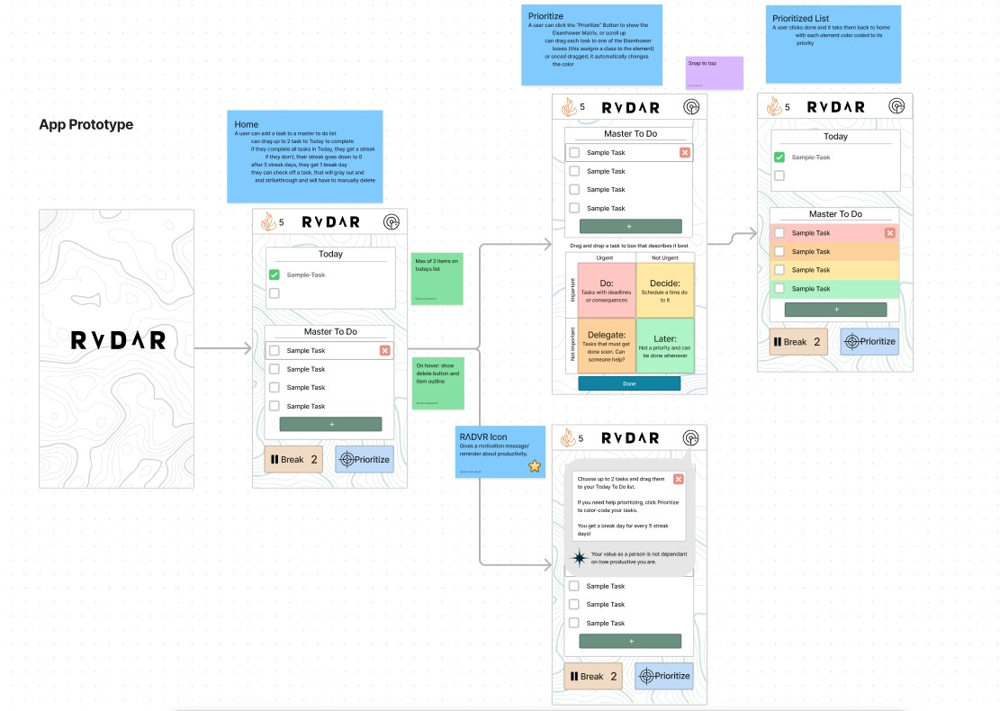
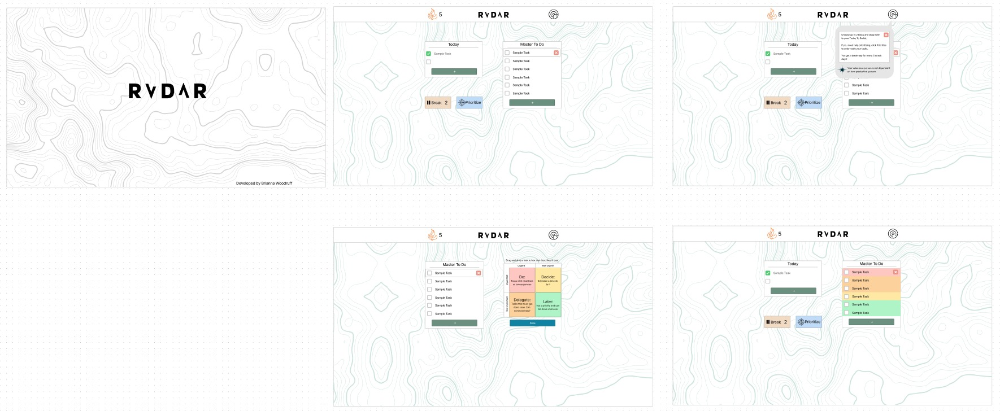

  

  ***-Currently In Production-***

  <h3>RVDΛR is a tool to simplify the overwhelming and never ending to do list by helping you prioritize your tasks into more manageable pieces.</h3>

  ---

  ## Description:

  Do you get overwhelmed by your seemingly never ending to do list to the point where you don't know where to start? And because you don't know where to start, you feel paralyzed and can't do anything even though you want to? This is called Executive Dysfunction and is fairly common amongst neurodivergent people, especially those with ADHD. It's a combination of cognitive, behavioral, and emotional difficulties that make it difficult to plan, organize, and manage time, such as completing your daily tasks.  
  
  Well instead of feeling like you have to do everything all at once, what if you only had to do one task in a day? That's a lot more doable and productive, right? But where do you start? 
  
  RVDΛR is more than a simple task manager application, it's a tool to help you pick one or two tasks to do **today** and if you can't pick, will help you prioritize which tasks need to be done sooner. Each day you complete a task, you earn a streak, and after five streak days, you earn a break day! It not about *maximizing* productivity, but taking small steps towards your goals and not beating yourself up about it.

## Table of Contents:

  * [Technologies Used](#technologies-used)
  * [Design](#design)
  * [Usage](#usage)
  * [License](#license)
  * [Contact](#contact)

## Technologies Used

 
 
 
 
 
 

## Design:

### Mobile

### Web

## Usage:

Add your tasks to your "Master To Do" list and drag one or two of those tasks to "Today". You can check off or delete any to dos. If you need help prioritizing your tasks, click "Prioritize" at the bottom to show the Eisenhower Matrix. Drag and drop each task to the section that best describes it to color code it and sort by priority.  

After everyday that you complete your "Today" task(s), you earn a streak day and after 5 streak days, you earn 1 break day. A break day allows you to take a day off from completing tasks and won't break your streak! But be careful because you only get a max of 7 streak days.

## License: 

    
  Licensed under MIT License.

## Contact:

### Brianna Woodruff  

briannaewoodruff@gmail.com

